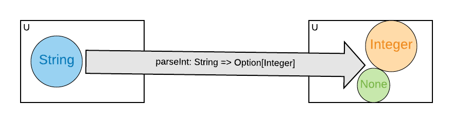
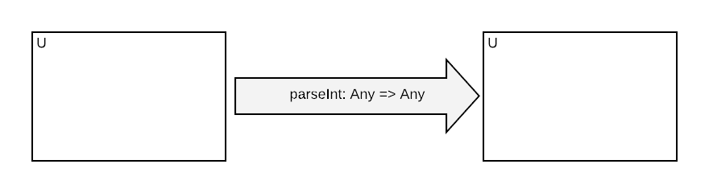

# Functional Programming Foundations

Functional Programming (FP) is a programming style emphasising the use of *functions*. Stream-oriented FP, which
 is the topic of this workshop, additionally emphasises *streams* to represent computations that repeat multiple times,
 typically either because we need to do a similar task for different data items, or perform a similar task at different
 times.

 Before introducing streams, we'll start with the general foundation concepts of functional programming.

 ## Functions

 In FP, functions are defined similarly to mathematics:

 - They may have a name or they may be anonymous
 - They have zero to N parameters
 - They compute a result- or return- value
 - Other than their return value, they have no other effects on the world
 - For given input parameters, they always compute the same result


### Referential Transparency

The last two properties, when combined, mean that a function invocation may be freely substituted for its result value,
without making an observable difference to the world. This property is called *referential transparency*.

The term *pure* is often used to describe functions that are *referentially transparent*; the meanings are equivalent.

```scala mdoc
object TransparentExample {

  def square(n: Int): Int = n * n

  //these two are equivalent
  val twoSquared_1 = square(2)
  val twoSquared_2 = 4
}
object NonTransparentExample {

  def square(n: Int): Int = {
    println(s"Calculating the square of $n")
    n * n
  }

  //these two are not equivalent, as one prints to console
  val twoSquared_1 = square(2)
  val twoSquared_2 = 4
}
```

## Statically Typed Functional Programming

This workshop teaches *statically typed* functional programming. Static typing classifies all the terms (ie data
 and functions) in the program using a type. A type defines and constrains the *set* of possible values that the term can
 hold.

So in typed FP, we additionally must specify the type of each function parameter, and the type of the function result.

### Types Are Sets

A type describes a set of values. By annotating a functions inputs and outputs with a type, we are describing the set of
values that it consumes and emits. In statically typed functional programming, we should strive to use accurate types:

- Our functions are defined (will run without errors) for any element of the input set
- The type of the return value includes and tightly bounds the possible outputs of our functions. (The definition of tightly
 binding is a little ambiguous and judgement is required).

Consider for example a function `parseInt` that tries to parse a `String` into an `Option[Integer]`. We can view that as
a mapping from every element in the  set of Strings to the union of the set of Integers and the value `None`,
 representing a failed parse.



### Untyped Programming

Many popular languages, such as Ruby, Python and Javascript do not use static types. Viewed from a typed perspective, functions
in these languages are completely unconstrained, and map any input value to any possible output value.



In practice, functions in these languages operate over a much small set of inputs and outputs, and it is up to the programmer
to keep track of the types of data. So the type system is implemented in the programmer's head rather than in the rules
of the language.

While this allows for an informal notation that can be more quickly learned by new programmers, as program size and
complexity scale up the burden of manually tracking data types grows ever greater.

### Types And Exceptions

One common way that functions fail to honour their return values is to throw exceptions rather than returning. This is a
no-no in FP, except for truly anomalous & fatal errors, especially as its readily handled by acknowledging the error
possibility is the return type.

```scala mdoc
object UseEitherNotExceptions {

  def squareRoot_Incorrect(d: Double): Double =
    if (d < 0) throw new Exception(s"$d is negative") else math.sqrt(d)

  def squareRoot_Correct(d: Double): Either[String, Double] =
    if (d < 0) Left(s"$d is negative") else Right(math.sqrt(d))
}
```
The key objection to using exceptions in FP is that it requires jumping into a special execution mode with different semantics,
and it turns out to be just as easily handled within the standard FP model using `Either` and related concepts.

### Non-termination and Total Functions

A more subtle problem is functions that don't terminate but rather run forever.

```scala mdoc
object NonTerminating {

  //we can ascribe any return type, even though it's nonsense, since the function will call itself infinitely
  def loop: String = loop
}
```

When the above qualities are true, including non-termination, a function is called *total*. In practice Scala has no way
of determining if a function is total or even pure, but it's a good conceptual goal to aim for when designing functions.


### Quiz: Which of the methods in the examples below are pure functions?

```scala mdoc
object Q1 {

  def head[T](l: List[T]): T = l.head

  def headOption[T](l: List[T]): Option[T] = l.headOption
}
```

<details><summary>Q1 Answer</summary><p>

`head`: Impure. Can have the effect of throwing an exception rather than returning a value of type `T`.

`headOption`: Pure.

</p></details>


```scala mdoc
class Q2[T](l: List[T]) {

    def unCons: (Option[T], Q2[T]) = l match {
      case h :: t => (Some(h), new Q2(t))
      case nil => (None, new Q2(nil))
    }
}
```

<details><summary>Q2 Answer</summary><p>

`unCons`: Pure. When object-oriented syntax is desugared, there's an extra `this` parameter passed to every method. So
the use of the class field `l` is actually via a hidden parameter.

</p></details>
