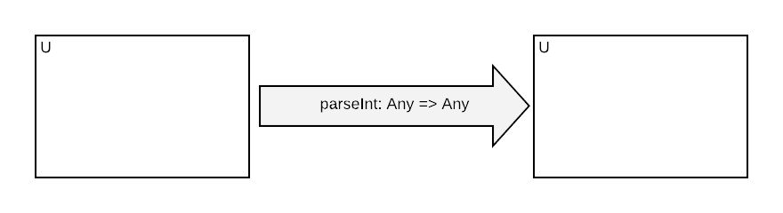

# Functional Programming Foundations

Functional Programming (FP) is a programming style emphasising the use of *functions*. Stream-oriented FP, which
 is the topic of this workshop, additionally emphasises *streams* to represent computations that repeat multiple times,
 typically either because we need to do a similar task for different data items, or perform a similar task at different
 times.

 Before introducing streams, we'll start with the general foundation concepts of functional programming.

## Functions

 In FP, functions are defined similarly to mathematics:

 - They may have a name or they may be anonymous
 - They have zero to N parameters
 - They compute a result- or return- value
 - Other than their return value, they have no other effects on the world
 - For given input parameters, they always compute the same result


### Purity / Referential Transparency

The last two properties, when combined, mean that a function invocation may be freely substituted for its result value,
without making an observable difference to the world. This property is called *referential transparency*.

The term *pure* is often used to describe functions that are *referentially transparent*; the meanings are equivalent.

```scala mdoc
object TransparentExample {

  def square(n: Int): Int = n * n

  //these two are equivalent
  val twoSquared_1 = square(2)
  val twoSquared_2 = 4
}
object NonTransparentExample {

  def square(n: Int): Int = {
    println(s"Calculating the square of $n")
    n * n
  }

  //these two are not equivalent, as one prints to console
  val twoSquared_1 = square(2)
  val twoSquared_2 = 4
}
```

### Non-termination and Total Functions

A more subtle problem is functions that don't terminate but rather run forever.

```scala mdoc
object NonTerminating {

  //we can ascribe any return type, even though it's nonsense, since the function will call itself infinitely
  def loop: String = loop
}
```

When the above qualities are true, including non-termination, a function is called *total*. In practice Scala has no way
of determining if a function is total or even pure, but it's a good conceptual goal to aim for when designing functions.

### Quiz: Which of the methods in the examples below are pure functions?

```scala mdoc
object Q1 {

  def head[T](l: List[T]): T = l.head

  def headOption[T](l: List[T]): Option[T] = l.headOption
}
```

<details><summary>Q1 Answer</summary><p>

`head`: Impure. Can have the effect of throwing an exception rather than returning a value of type `T`.

`headOption`: Pure.

</p></details>


```scala mdoc
class Q2[T](l: List[T]) {

    def unCons: (Option[T], Q2[T]) = l match {
      case h :: t => (Some(h), new Q2(t))
      case nil => (None, new Q2(nil))
    }
}
```

<details><summary>Q2 Answer</summary><p>

`unCons`: Pure. When object-oriented syntax is desugared, there's an extra `this` parameter passed to every method. So
the use of the class field `l` is actually via a hidden parameter.

</p></details>

### A Impure Secret: The Purity Convention

We've looked at the idea that when a function is pure, it has no other effects on the world than its return value, and
it always deterministically computes the same result.

It's commonly accepted that a function that allocates memory on the heap while running is still pure,
but a function that writes bytes to a disk is impure. But we might reasonably ask why writing bytes to DRAM chips for a heap
allocation is pure, and yet bytes sent to magnetic storage are treated differently?

Similarly, it is always possible that during a heap allocation, the JVM could run out of memory and throw an exception. If
this occurred during an invocation of a pure function, it would have behaved differently to previous invocations.

The point of these examples is to show that the typical definition of *purity is a programming convention*, and not
something to be religious about. It is a sensible convention for *practical* reasons:

- Computer memory is highly reliable, the latency in storage and retrieval are hard to observe, and it is cleaned up when
a program terminates. Therefore, we treat memory as an ideal store, and choose to ignore the small ways it deviates from
ideal behavior.
- Disks have a higher latency for access, a higher failure rate, and their contents are long lasting. We consider it
unwise to treat them as an ideal store, and instead model interactions with disks as external effects.

Typically, when when the underlying machine observably deviates from the assumed abstract machine, we treat that as a
fatal error or anomaly in functional programming, closing the program or restarting the affected operation.

### Currying

We saw earlier that functions can have zero to N parameters. Currying is a transformation that allows us to convert any
function of *multiple* parameters into a function with a *single* parameter. The way a curried function works is that it
accepts the first parameter, then returns a function accepting the remaining parameters.

```scala mdoc
object Currying {

  val function2Params: (Int, List[String]) => Option[String] = (n, l) => l.lift(n)

  val curried: Int => (List[String] => Option[String]) = (n: Int) => function2Params(n, _)
}
```
If unfamiliar, the underscore `_` in the example above converts the `function2Params(n, _)` into an anonymous function
of one parameter to "fill the hole", ie with a parameter of type `List[String]`

Currying in simply a mechanical transformation, that lets us feed a function its parameters in stages. We can also provide
parameters "out of order" easily.

```scala mdoc
object OutOfOrder {

  val function2Params: (Int, List[String]) => Option[String] = (n, l) => l.lift(n)

  val outOfOrder: List[String] => (Int => Option[String]) = (l: List[String]) => function2Params(_, l)
}
```

The takeaway is that the number and ordering of function parameters is a matter of syntactic convenience, and can
always be changed if desired by means of mechanical transformations, without changing the meaning of a program.

## Statically Typed Functional Programming

This workshop teaches *statically typed* functional programming. Static typing classifies all the *terms* (ie data
 and functions) in the program using a *type*. A type defines and constrains the *set* of possible values that the term can
 take on.

 Note that a term can *inhabit* (satisfy) many types at once, just as an element can be a member of many sets.

So in typed FP, we additionally must specify the type of each function parameter, and the type of the function result.

### Types Are Sets

A type describes a set of values. By annotating a functions inputs and outputs with a type, we are describing the set of
values that it consumes and emits. In statically typed functional programming, we should strive to use accurate types:

- Our functions are defined (will run without errors) for any element of the input set
- The type of the return value includes and "tightly bounds" the possible outputs of our functions. (The definition of tightly
 bounding is a little ambiguous and judgement is required).

Consider for example a function `parseInt` that tries to parse a `String` into an . We can view that as
a mapping from every element in the  set of Strings to the union of the set of Integers and the value `None`,
 representing a failed parse.

In a language with subtyping like Scala, we could also define `parseInt` to return the `Any`
 supertype; while that typechecks, it fails the "tight binding" criterion, since very few of `Any`'s total inhabitants lie
 within `Option[Integer]`.


### Untyped Programming

Many popular languages, such as Ruby, Python and Javascript do not use static types. Viewed from a typed perspective, functions
in these languages are completely unconstrained, and map any input value to any possible output value.



In practice, functions in these languages operate over a much small set of inputs and outputs, and it is up to the programmer
to keep track of the types of data. So the type system is implemented in the programmer's head rather than in the rules
of the language.

While this allows for an informal notation that can be more quickly learned by new programmers, as program size and
complexity scale up the burden of manually tracking data types grows ever greater.

### Types And Exceptions

One common way that functions fail to honour their return values is to throw exceptions rather than returning. This is a
no-no in FP, except for truly anomalous & fatal errors, especially as its readily handled by acknowledging the error
possibility is the return type.

```scala mdoc
object UseEitherNotExceptions {

  def squareRoot_Incorrect(d: Double): Double =
    if (d < 0) throw new Exception(s"$d is negative") else math.sqrt(d)

  def squareRoot_Correct(d: Double): Either[String, Double] =
    if (d < 0) Left(s"$d is negative") else Right(math.sqrt(d))
}
```
The key objection to using exceptions in FP is that it requires jumping into a special execution mode with different semantics,
and it turns out to be just as easily handled within the standard FP model using `Either` and related concepts.


## Effects

Lets look now at how we build functional programs that do have effects on the outside world.

The idea is that we have a functional, pure core to our software that describes, or computes, what effects the software should
have, given inputs from the outside world. Our pure computation will yield an *effectful action*, which can be run to
process inputs, do computations, and cause (side-) effects: real observable changes in the world such as network or disk
IO.

Then, right at last point in our functional program, sometimes called the "end of the world", we set this action
running.

So functional programming isn't so much about avoiding side-effects as it is about separating the pure and effectful
aspects of our program into two distinct phases. A functional program has been likened to a fruit, with a pure interior
surrounded by a thin effectful rind or skin.

### Exercise: Refactoring Effects to the Edge

In this exercise, I encourage you to try applying the ideas above by refactoring this program to move all the effects
to the `main` method, leaving the remainder of the program pure and free of mutable state.

[Edit on Scala Fiddle (advise open in new tab)](https://scalafiddle.io/sf/xdwyVXW/0)

```scala mdoc:reset
import collection.mutable.ArrayBuffer

case class Website(ads: ArrayBuffer[Ad] = ArrayBuffer.empty)

object Website {

  def buyAd(text: String)(site: Website, cc: CreditCard) = {
    val ad = new Ad(text)
    site.ads += ad
    cc.charge(ad.price)
  }
}
//CreditCard contains a mutable balance, so the charge operation causes side-effects
case class CreditCard(id: Long, var balanceOwing: Int) {

  def charge(amount: Int) = balanceOwing += amount
}
case class Ad(text: String) {

  def price = 10 + math.min(text.length, 40)
}

object ImperativeMain {

  def main() = {
    val site = Website()
    val cc = CreditCard(1111222233334444L, 0)
    Website.buyAd("Functional Programming is cool!")(site, cc)
    printStatus(site, cc)
  }

  def printStatus(site: Website, cc: CreditCard) =
    println(s"After purchase, I have ${cc.balanceOwing} owing on my card. There are ${site.ads.size} on site.")
}
```

</div>


#### Sample Solution

<details>

Note: the `tupled` operator below mechnically transforms a functions parameter list from accepting N parameters to accepting
one parameter, an N-tuple of the same types as the original.

```scala mdoc:reset
case class Website(ads: List[Ad] = List.empty[Ad])

object Website {

   def buyAd(text: String, site: Website, cc: CreditCard): (Website, CreditCard) = {
    val ad = new Ad(text)
    (site.copy(ads = site.ads :+ ad), cc.charge(ad.price))
  }
}

case class CreditCard(id: Long, val balanceOwing: Int) {

  def charge(amount: Int) = copy(balanceOwing = this.balanceOwing + amount)
}
case class Ad(text: String) {

  def price = 10 + math.min(text.length, 40)
}

object FunctionalMain {

  //we still have side-effects and mutable state, but they are confined to the top-level, ie `main`
  def main() = {
    var appState = (Website(), CreditCard(1111222233334444L, 0))
    appState = Website.buyAd("Functional Programming is cool!", appState._1, appState._2)
    println(status(appState._1, appState._2))
  }

  def status(site: Website, cc: CreditCard) =
      s"After purchase, I have ${cc.balanceOwing} owing on my card. There are ${site.ads.size} on site."
}
```

</details>

## Cats IO: A building block effect

`IO` is effect abstraction provided by the [`Cats Effect`]() that we'll use heavily in the remainder of this tutorial.

We use `IO` by wrapping it around code that causes side-effects, such as read- or write- io, or accessing the system clock,
or mutating an externally visible variable. `IO` *suspends* the wrapped code, meaning that it get's stored up as a runnable
value but doesn't run when created. Whatever value the wrapped expression returns, call it `A`, becomes the value of the
IO, ie `IO[A]`. So for example, an `IO` action that effectfully reads bytes off the network might return `IO[Array[Byte]]`,
being the data read when it is finally run.

`IO` has a monad defined, so we can chain together `IO`s, feeding the result of one into the input of the next. It also
provides operations for launching two `IO` actions concurrently and waiting for one or all of them to complete. The intent
is that we build up a description of all the effectful actions in our program as a graph of `IO` values, which is a pure
computation, and then set run running at the end with an operation like [`unsafeRunSync`](), which starts them running.

The `unsafe` prefix is not intended to imply the method shouldn't be called, but rather to alert programmers that when
called they are leaving the pure world and actually causing effects.

`IO` has some built in error handling, because effectful code can of course throw runtime exceptions. So an `IO[A]` should
yield an `A` but may alternately yield an exception when run.

TODO Cats IO Examples


